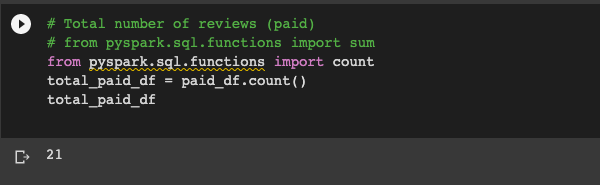
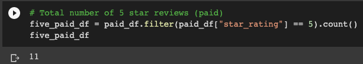
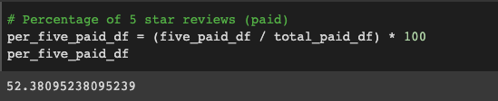
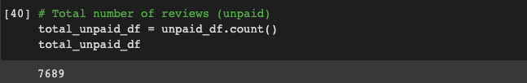
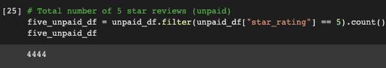
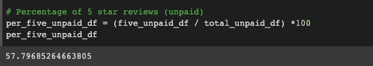

# Amazon_Vine_Analysis

## Objective 
For this project, I have chosen the jewelry reviews dataset from Amazon Review and will use PySpark to perform the ETL process to extract, transform the data, connect to an AWS RDS instance, and load the transformed data into pgAdmin.  Additionally, I will use PySpark to determine if there is any bias toward favorable reviews from Vine members in your dataset.  

### Tasks
- Deliverable 1: Perform ETL on Amazon Product Reviews
- Deliverable 2: Determine Bias of Vine Reviews
- Deliverable 3: A Written Report on the Analysis (README.md)

## Resources
### Tools/Language
- PySpark spark-3.0.3
- Google CoLab
- PgAdmin 4 Version 6.1
- PostgreSQL 12.10-R1 
- AWS

### Sites/Data
- https://s3.amazonaws.com/amazon-reviews-pds/tsv/index.txt (datasets to choose from)

- https://s3.amazonaws.com/amazon-reviews-pds/tsv/amazon_reviews_us_Jewelry_v1_00.tsv.gz (project dataset)

- https://data-hacks.com/convert-pyspark-dataframe-column-from-string-to-int-type-python (fixed error received while loading vine_df, converted star_rating column from string to integer)

## Results

### Vine Reviews

#### Total Number of Reviews

#### 5 Star Reviews

#### Percentage of Five Star Reviews

### Non-Vine Reviews

#### Total Number of Reviews

#### 5 Star Reviews

#### Percentage of Five Star Reviews

## Summary

Given that only 52% of the jewelry reviews had a 5 star rating, I would not agree that there is a positivity bias for the Vine program.  

An additional analysis to confirm if there is positivity bias is comparing the number of verified purchases between the Vine and non-Vine reviews.